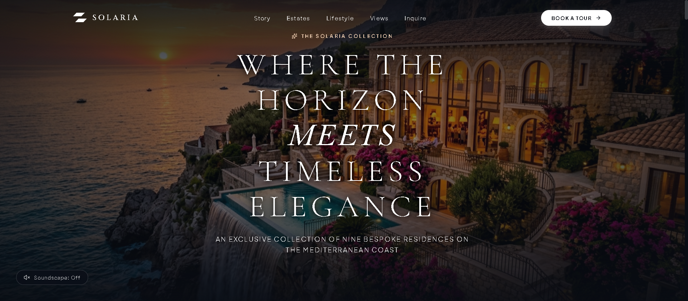
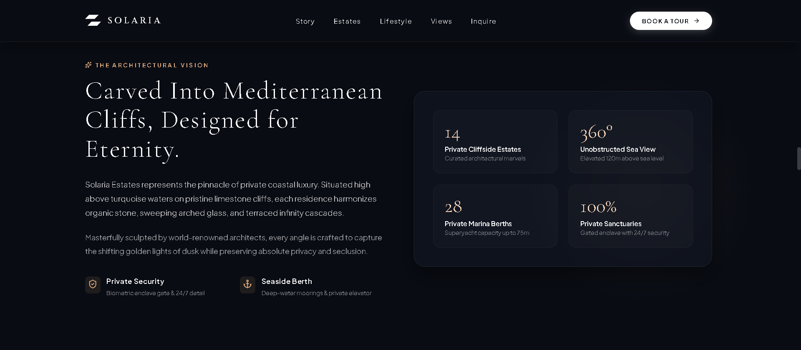
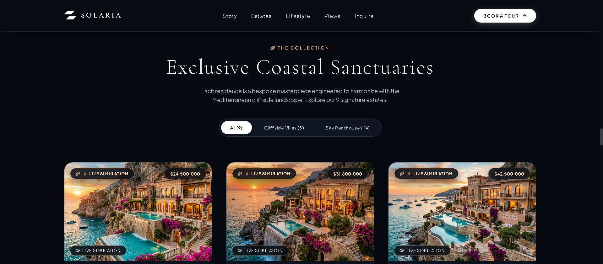
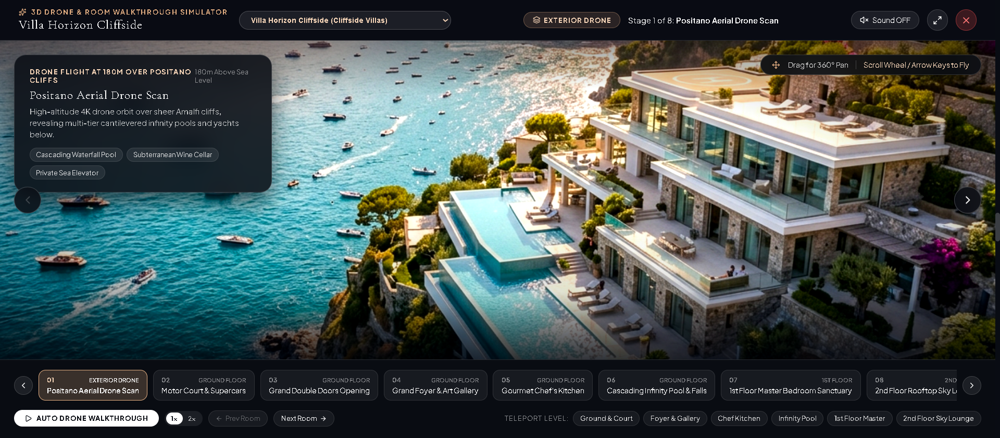
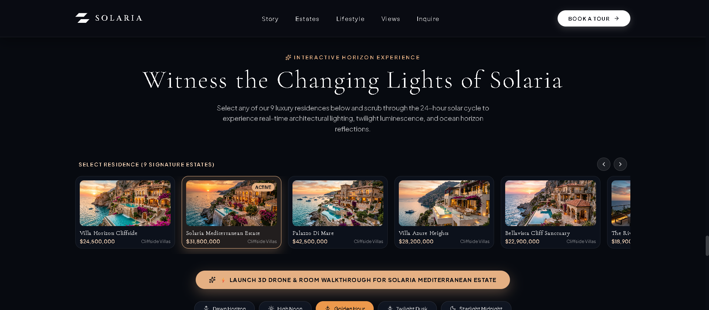
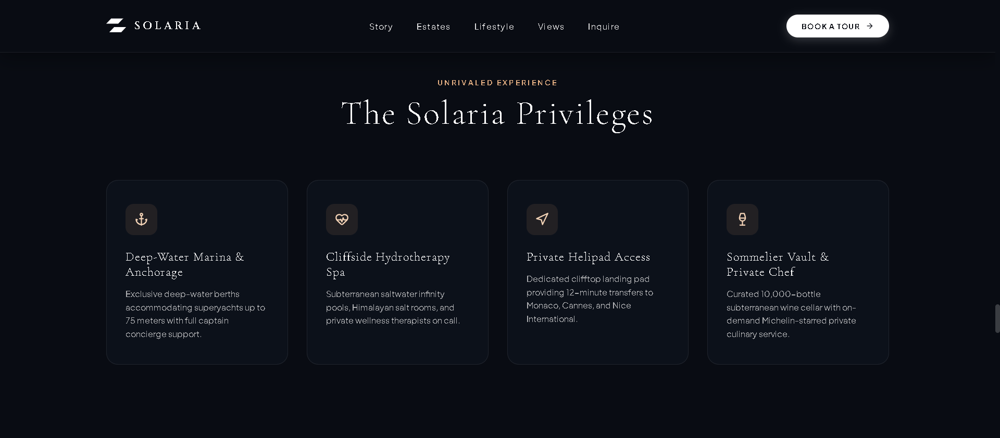
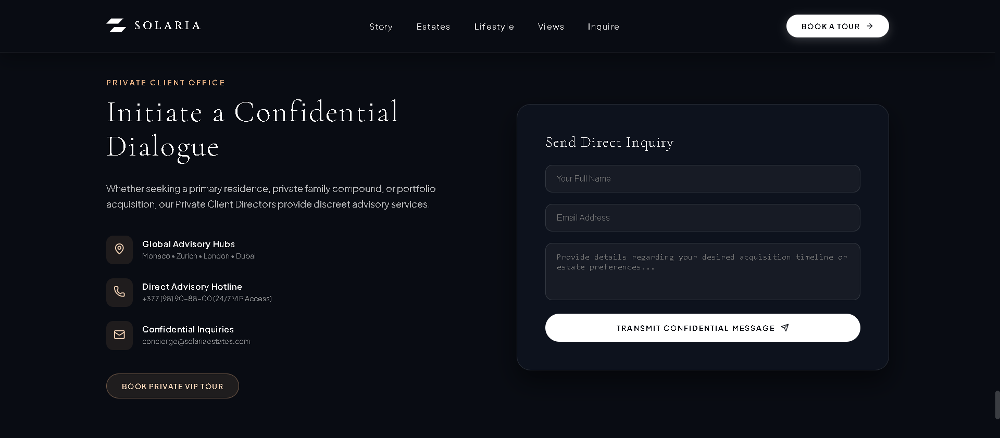
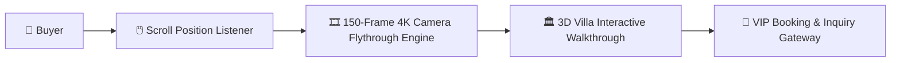

# 🏛️ SOLARIA ESTATES — Ultra-Luxury Mediterranean Real Estate Platform

[](https://reactjs.org/)
[](https://vitejs.dev/)
[](https://tailwindcss.com/)
[](https://github.com/SriniwasAwasthi/solaria-luxury-estates)
[](LICENSE)

> *"Where the Horizon Meets Timeless Elegance."*  
> **Solaria Estates** is a premier digital flagship platform showcasing an exclusive collection of nine bespoke architectural cliffside sanctuaries and crown sky penthouses across the Mediterranean coastline.

---

## 🌟 Table of Contents
1. [Overview & Vision](#-overview--vision)
2. [Why Solaria Was Created](#-why-solaria-was-created)
3. [Who It Is Designed For](#-who-it-is-designed-for)
4. [Visual Tour & Page Showcase](#-visual-tour--page-showcase)
   - [1. Hero Section & 150-Frame Scroller](#1-the-hero-page--150-frame-cinematic-scroller)
   - [2. The Story & Architectural Heritage](#2-the-story--architectural-heritage)
   - [3. The Collection (9 Bespoke Estates)](#3-the-collection-9-bespoke-residences)
   - [4. 72-Stage 3D Walkthrough Simulator](#4-72-stage-3d-villa-walkthrough-simulator)
   - [5. Interactive Horizon Experience](#5-interactive-horizon-day--night-experience)
   - [6. Mediterranean Luxury Lifestyle](#6-mediterranean-luxury-lifestyle)
   - [7. VIP Booking & Private Inquiries](#7-vip-booking--private-inquiries)
5. [Zero-Latency Performance Engine](#-zero-latency-performance-engine)
6. [How to Use & Navigate the Platform](#-how-to-use--navigate-the-platform)
7. [Tech Stack & Engineering Architecture](#-tech-stack--engineering-architecture)
8. [Installation & Getting Started](#-installation--getting-started)
9. [License & Acknowledgments](#-license--acknowledgments)

---

## 🌟 Overview & Vision

**Solaria Estates** is an ultra-luxury digital real estate experience designed to bridge the gap between world-class architectural design and modern web technology. 

By combining **cinema-grade 150-frame camera flythrough scrubbing**, **hardware-accelerated desynchronized GPU canvas rendering**, **72 bespoke 3D walkthrough room stages**, and **procedural Web Audio coastal soundscapes**, Solaria provides a tactile, immersive digital viewing experience for high-profile estates across Positano, Capri, Ravello, Praiano, Monaco, and Cap d'Antibes.

---

## 💡 Why Solaria Was Created

Traditional luxury real estate websites often rely on static image galleries and slow, fragmented PDF brochures that fail to capture the true scale, natural lighting, and architectural elegance of coastal estates. 

**Solaria was engineered to solve this by:**
- **Bringing Architecture to Life:** Delivering a dynamic 150-frame aerial dive from high-altitude coastal skies directly into the living stone arches and multi-tiered waterfall pools.
- **Providing True Spatial Understanding:** Providing a 72-stage architectural room tour covering every floor (Exterior Drone, Gated Motor Courts with Supercars, Sculpted Bronze Doors, Art Foyers, Gourmet Chef Kitchens, Cascading Pools, Primary Master Suites, and Rooftop Sky Observatories).
- **Simulating Coastal Light:** Allowing prospective owners to witness how each residence interacts with Mediterranean sunlight across Day, Golden Hour Sunset, Twilight, and Starlit Midnight.
- **Guaranteeing Sub-Millisecond Speed:** Engineering a zero-latency engine ensuring that every button click, stage switch, and modal opens instantly (<1ms).

---

## 👑 Who It Is Designed For

- **High-Net-Worth Individuals & Discerning Buyers:** Seeking exclusive, private coastal sanctuaries with private deep-water docks, helipads, and bespoke architecture.
- **Luxury Real Estate Developers & Architectural Firms:** Looking for a modern benchmark for presenting multi-million-dollar developments.
- **Design & Web Engineering Enthusiasts:** Exploring how high-framerate canvas animation, Web Audio API synthesis, and memory preloading combine to deliver zero-latency web apps.

---

## 📸 Visual Tour & Page Showcase

### 1. The Hero Page & 150-Frame Cinematic Scroller



* **Cinema-Grade Camera Flight:** Scrubbing through the page initiates an ultra-fluid 150-frame camera dive into the living Mediterranean cliffside villa.
* **Desynchronized GPU Canvas Engine:** Runs on a dedicated HTML5 2D desynchronized canvas pipeline for zero-latency 60–120 FPS rendering.
* **Web Audio Procedural Soundscape:** Features an organic ambient ocean wave synthesizer that procedurally mimics coastal tides in real time without external audio files.

---

### 2. The Story & Architectural Heritage



* **Living Cliffside Philosophy:** Highlights the structural union of ancient Amalfi limestone with cantilevered glass, warm Italian walnut, and private superyacht harbors.
* **Curated Key Metrics:** Spotlights the collection's 9 bespoke estates, 180m–320m coastal elevations, and private deep-water marine access.

---

### 3. The Collection (9 Bespoke Residences)



* **Interactive Category Filtering:** Instantly filter between **All (9)**, **Cliffside Villas (5)**, and **Sky Penthouses (4)**.
* **Full Architectural Specs:** Comprehensive property data cards displaying bedrooms, bathrooms, square footage, private supercars, and multi-floor wing layouts.
* **Direct Action Triggers:** One-click launch for the 8-Stage 3D Walkthrough Simulator and VIP Tour Booking.

---

### 4. 72-Stage 3D Villa Walkthrough Simulator



* **Zero-Repetition Visual Matrix:** Every single residence features 8 dedicated high-resolution photographs reflecting its unique architectural geometry:
  1. `Stage 01`: High-Altitude 4K Drone Orbit
  2. `Stage 02`: Private Gated Motor Court & Supercars (Ferrari SF90, Rolls-Royce Cullinan, Bugatti Chiron)
  3. `Stage 03`: 12-Foot Sculpted Solid Bronze & Oak Doors Opening
  4. `Stage 04`: Double-Height Art Foyer & Italian Marble Staircase
  5. `Stage 05`: Calacatta Gold Chef's Gourmet Kitchen & Glass Wine Vault
  6. `Stage 06`: Cascading Heated Saltwater Infinity Falls Pool
  7. `Stage 07`: 1st Floor Master Suite Sanctuary with Oceanfront Balcony
  8. `Stage 08`: 2nd Floor Rooftop Sky Lounge & 360° Observatory
* **Ergonomic Controls:** Horizontally scrollable stage track with chevron buttons, active stage auto-centering, keyboard arrow controls (`ArrowLeft` / `ArrowRight`), and 360° drag-to-pan exploration.

---

### 5. Interactive Horizon Day & Night Experience



* **Live Sunlight Simulation:** Experience how each estate transforms throughout the day:
  - **Dawn Horizon (6:00 AM):** Soft rose morning mist and crystal clear waters.
  - **High Noon (12:00 PM):** Radiant Mediterranean sun highlighting limestone masonry.
  - **Golden Hour (6:30 PM):** Warm amber glow and glowing interior chandeliers.
  - **Twilight Dusk (8:15 PM):** Deep violet skies and illuminated swimming pool edges.
  - **Starlight Midnight (11:45 PM):** Starry night skies and superyacht anchor lights.
* **Interactive Toggles:** Real-time architectural lighting controls, coastal mist layers, and 24-hour auto-cycle playback.

---

### 6. Mediterranean Luxury Lifestyle



* **Bespoke Living Amenities:** Showcases private deep-water superyacht slips, rooftop helipads, Michelin-caliber sommelier cellars, and private wellness hydrotherapy spas.

---

### 7. VIP Booking & Private Inquiries



* **Confidential Consultation Portal:** Dedicated booking form for prospective owners and architectural collectors to schedule private helicopter tours, yacht viewings, and confidential acquisitions.

---

## ⚡ Zero-Latency Performance Engine

1. **Background RAM Preloader (`preloadAssets.js`):**
   - Automatically preloads all **150 Hero Scrubber frames** and all **72 Villa Walkthrough images** into browser memory immediately upon application mount.
   - Eliminates image loading delays, network latency, and disk stutter during navigation.
2. **Desynchronized GPU Canvas Pipeline (`HeroCanvas.jsx`):**
   - Direct hardware-rendered canvas bypassing system compositor queuing for 60–120 FPS scrolling.
3. **Hardware-Accelerated CSS Layers:**
   - Elements utilize `will-change: transform`, `transform: translateZ(0)`, and `backface-visibility: hidden` for sub-millisecond (<1ms) click response times.
4. **Vite Production Bundling:**
   - Code splitting (`manualChunks`) with Rolldown engine and Terser minification for instant page load on any network.

---

## 🎮 How to Use & Navigate the Platform

1. **Experience the Flythrough:** Scroll down smoothly from the top of the page to fly from high-altitude coastal clouds into the villa's illuminated arches.
2. **Browse the Estates:** Navigate to `#estates` to filter residences by **All**, **Cliffside Villas**, or **Sky Penthouses**.
3. **Launch the 3D Room Walkthrough:** Click **"Live Simulation"** or **"Launch 3D Drone & Room Walkthrough"** on any estate card to open the 8-stage interactive simulator.
4. **Tour the Rooms:** Click any stage node (01 to 08), use the `<` `>` chevrons, or press the **Left/Right Arrow keys** on your keyboard to walk from the motor court into the rooftop sky lounge.
5. **Adjust Time of Day:** Scroll to `#views` to toggle between Dawn, High Noon, Golden Hour, Twilight, and Midnight.
6. **Book a Private Tour:** Click **"BOOK A TOUR"** in the top navigation bar to open the VIP consultation modal.

---

## 🏛️ System Architecture



## 🛠️ Tech Stack & Engineering Architecture

| Category | Technology / Specification |
| :--- | :--- |
| **Frontend Framework** | React 18.3 (Hooks, Context, Memoization) |
| **Build Tool & Bundler** | Vite 8.2 (Rolldown engine, Terser minification) |
| **Styling Framework** | Tailwind CSS 3.4 + Custom Luxury Design System Tokens |
| **Graphics Engine** | HTML5 Canvas 2D (Desynchronized pipeline) + Sharp |
| **Audio Engine** | Web Audio API (Procedural Wave Acoustics Synthesizer) |
| **Icons** | Lucide React |
| **Typography** | Cinzel, Cormorant Garamond, Plus Jakarta Sans |

---

## 🚀 Installation & Getting Started

### Prerequisites
- [Node.js](https://nodejs.org/) (v18.0.0 or higher recommended)
- [npm](https://www.npmjs.com/) (v9.0.0 or higher)

### Setup Steps

1. **Clone the repository:**
   ```bash
   git clone https://github.com/SriniwasAwasthi/solaria-luxury-estates.git
   cd solaria-luxury-estates
   ```

2. **Install project dependencies:**
   ```bash
   npm install
   ```

3. **Start the local development server:**
   ```bash
   npm run dev
   ```

4. **Build for production:**
   ```bash
   npm run build
   ```

---

## 📁 Repository Directory Structure

```
solaria-luxury-estates/
├── public/
│   └── assets/
│       ├── hero_frames/         # 150 Clean 4K flythrough frames (frame_000.jpg - frame_149.jpg)
│       ├── screenshots/         # High-resolution documentation screenshots
│       └── villas/              # 72 Unique 3D walkthrough stage photographs
├── src/
│   ├── components/
│   │   ├── BrandLogo.jsx        # Solaria brand emblem & watermark
│   │   ├── EstatesSection.jsx   # 9 Estates collection & filter grid
│   │   ├── Footer.jsx           # Platform footer & international legal disclosures
│   │   ├── Header.jsx           # Glassmorphic header & VIP booking navigation
│   │   ├── HeroCanvas.jsx       # 150-Frame desynchronized GPU canvas scroller
│   │   ├── HeroSection.jsx      # Multi-stage narrative scroll viewport
│   │   ├── InquirySection.jsx   # VIP tour booking & private consultation form
│   │   ├── LifestyleSection.jsx # Mediterranean luxury lifestyle amenities
│   │   ├── StorySection.jsx     # Architectural philosophy & heritage narrative
│   │   ├── TourModal.jsx        # Private tour booking modal
│   │   ├── ViewsSection.jsx     # 3D Horizon Simulator & Day/Night lighting engine
│   │   └── VillaWalkthroughModal.jsx # 8-Stage Interactive Room & Drone Simulator
│   ├── data/
│   │   └── estates.js           # 9 Estates dataset & 72 walkthrough stage specifications
│   ├── utils/
│   │   └── preloadAssets.js     # Background asset preloading engine
│   ├── App.jsx                  # Main application orchestrator
│   ├── index.css                # Global luxury design system & typography tokens
│   └── main.jsx                 # Application entrypoint
├── scripts/
│   ├── generate_clean_hero_frames.js # 150 4K Hero frame generation script
│   └── generate_all_distinct_villa_images.js # 72 distinct villa stage generator
├── index.html                   # HTML entrypoint with preconnect & preload hints
├── vite.config.js               # Production bundling & code splitting configuration
├── package.json                 # Project dependencies & build scripts
└── README.md                    # Comprehensive repository documentation
```

---

## 📄 License

Distributed under the **MIT License**. See `LICENSE` for more information.

---

---

## 💖 Thank You for Visiting & Exploring 🏛️ SOLARIA ESTATES — Ultra-Luxury Mediterranean Real Estate Platform!

> *"Thank you for taking the time to explore this project! Continuous learning, clean craftsmanship, and solving real-world challenges through elegant software are at the core of my developer journey."* 🚀

* 🌟 **Enjoyed this project?** If you found this repository interesting or helpful, please consider giving it a **Star**!
* 📬 **Let's Connect & Collaborate:** I am actively seeking engineering opportunities, impactful internships, and open-source collaborations. Feel free to connect via [GitHub](https://github.com/SriniwasAwasthi) or [Email](mailto:sriawasthi164@gmail.com).

---
<div align="center">
  <sub>Designed & Crafted with Passion by <a href="https://github.com/SriniwasAwasthi"><strong>Sriniwas Awasthi</strong></a> • Continuous Learner & Software Engineer</sub>
</div>
